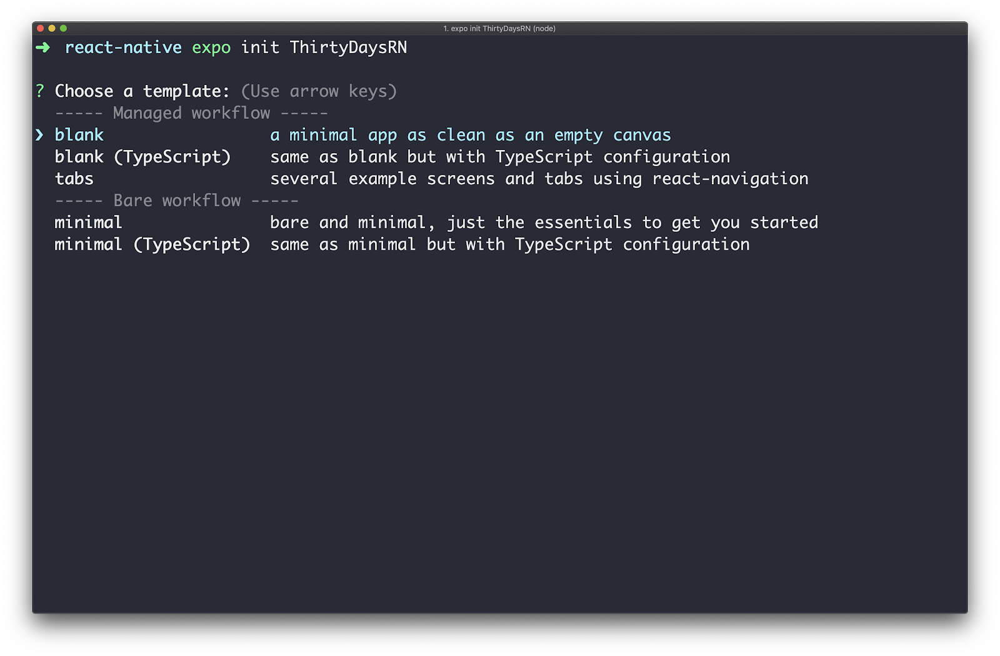
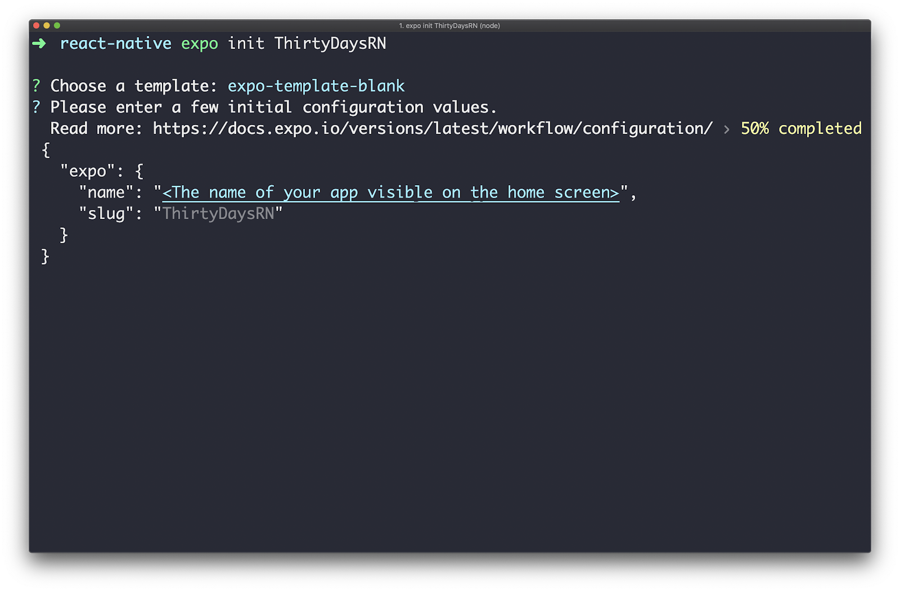
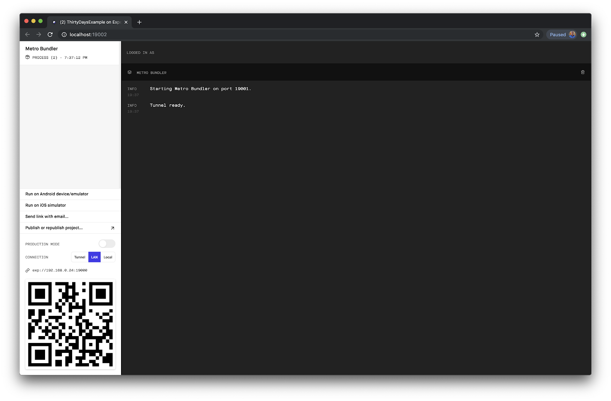
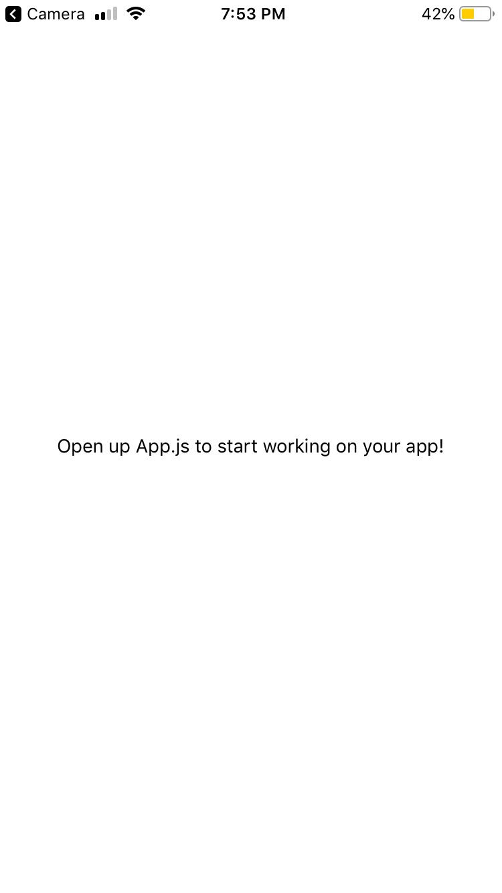

# Getting Started

> Expo provides a complete **managed workflow** that takes care of the entire build process.

Before we can begin covering different React Native concepts, we’ll need to know how to get up and running with a brand new application first. This includes installing any required dependencies and setting up a working development environment. By the end of this article, we’ll have an application up and running on a real device or simulator!

There are two ways to start building an application in React Native:

- React Native CLI
- Expo

In both cases, we can write the same exact React Native code for our application. However, there are differences between the workflows of both approaches. Let’s dive in!

## React Native CLI

React Native CLI is a command-line interface to create and run React Native apps. Using the CLI requires the dedicated development environments for iOS ([Xcode](https://developer.apple.com/xcode/)) and Android ([Android Studio](https://developer.android.com/studio)) to be installed and set-up in order to run and build an application.

## Expo

Expo is a platform that provides a set of tools and services to simplify the process of building and deploying React Native apps. Similar to [Create React App](https://create-react-app.dev/) for React, Expo allows you to start a new React Native application without any build configuration.

### Which option should I use?

Although React Native allows anyone to build for both mobile platforms without writing any native code, the CLI requires the use of their dedicated development environments (Xcode for iOS and Android Studio for Android) in order to build and deploy any application.

On the other hand, Expo provides a complete **managed workflow** that takes care of the entire build process. This not only makes building and publishing apps easier without having to download and configure several different IDEs, but it also allows developers to build iOS applications without owning a Mac computer.

However, Expo is not suitable for every application. Creating native modules in iOS or Android and bridging them to a new JavaScript API is not possible with Expo. This means that only the specific device APIs already provided by the platform can be used, but nothing more.

T> The [documentation](https://docs.expo.io/versions/v34.0.0/introduction/why-not-expo/0) explains this along with other reasons why Expo might not be the best option for every application.

Deciding which option to use can depend on whether you plan on creating a brand new mobile app or integrating React Native into an existing app. If you’re not sure, we recommend the following:

- If you are building a new React Native application from scratch, use Expo’s managed workflow. If at some point in the future you need something that is not provided by the platform, you can always eject.
- If you are integrating React Native into an existing iOS or Android app, use React Native CLI since Expo cannot be used to bridge custom native code.

Every article in this series, with the exception of "Native Modules", will rely on Expo since we’ll be creating new applications for each section. Let's explore how to get started with the platform!

## Starting a new project with Expo

First, ensure all required dependencies are installed. If you are using `npm`, make sure [Node](https://nodejs.org/en/) v10 or later is installed. Then install Expo CLI:

```bash
npm install -g expo-cli
```

T> If you are using `yarn`, run `yarn global add expo-cli` instead.

Once the CLI is installed, create a new React Native application called "ThirtyDaysRN":

```bash
expo init ThirtyDaysRN
```

We should now see a prompt to select a starting template for the application:



Expo provides a few options to choose from to start your application such as a completely minimal set-up for both managed and bare workflows [1] and a TypeScript option. The `tabs` template sets up base navigation using the [react-navigation](https://reactnavigation.org/) library. We’ll explore the concept of navigation later in this series.

Select the `blank` option for now. Another prompt will ask you to choose a name for your application that will be visible on the home screen.



Lastly, you’ll see a prompt asking to use `yarn` if it is detected. The CLI will then take a few minutes to download all the needed files. Once that's complete, navigate to the newly created directory and start the project:

```bash
cd ThirtyDaysRN
npm start
```

This kicks off the development server!


Expo DevTools is also opened in a new tab on your browser:



Expo Dev Tools allows us to view logs of the application and provides all the commands we can use to run and view the application.

Now that we have a local development server running, we just need to view the app! Expo provides a client iOS and Android app that allows developers to preview React Native application on our real device or simulator.

- If you have a physical Android device:

  - Install Expo client on Google Play
  - Select `Scan QR code` and scan the QR code in the terminal

- If you have a physical iOS device:

  - Install Expo client on the App Store
  - Scan the QR code with the Camera app

- If you would like to run on a simulator:
  - Press `a` to run on an Android emulator or press `i` to run on an iOS simulator

And now you should see the application running directly on your mobile phone:



To make sure everything is working as expected, change a line of code in the file that holds the root component, `App.js`:

```js
import React from "react";
import { StyleSheet, Text, View } from "react-native";

export default function App() {
  return (
    <View style={styles.container}>
      <Text>Let's change this line to see if it works!</Text>
    </View>
  );
}

const styles = StyleSheet.create({
  container: {
    flex: 1,
    backgroundColor: "#fff",
    alignItems: "center",
    justifyContent: "center"
  }
});
```

Save the file, and notice the application reload automatically!

<iframe src="https://snack.expo.io/embedded/@houssein/first-change?preview=true&platform=web" style="height: 20em" />

Now that we’ve covered how to get started with React Native, tomorrow we’ll write our very first component!

#### Footnotes

[1]: It is always possible to eject from an Expo managed workflow application to a bare workflow or select it from the very beginning. This transitions your app to use the React Native CLI. Expo APIs will then need to be imported like any other third-party library.
